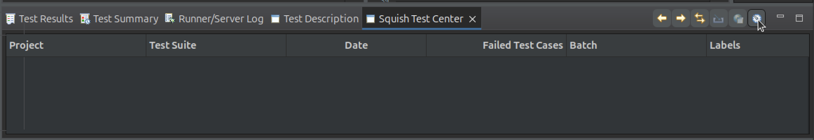
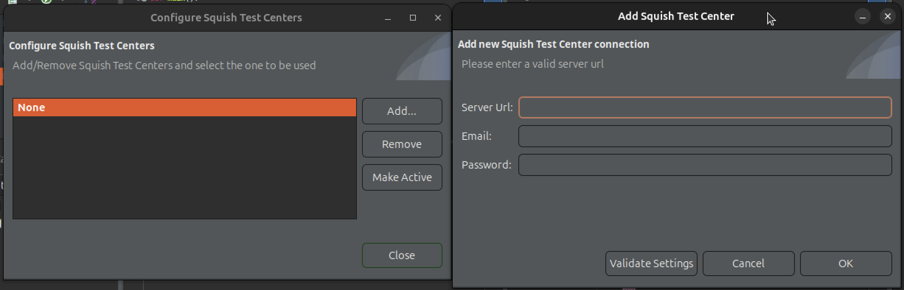

# Local Environment Changes

## localhost connection

## Remote Testing Requirements

1. In SQUISH_DIR/etc/squishserverrc file, uncomment the **ALLOWED_HOSTS** lines to allow remote connections

```
# Example allow every IP to access
ALLOWED_HOSTS=*
```
### Uploading Results

https://doc.qt.io/testcenter/uploading-results.html 

1. Make sure the squishrunner is in PATH in .bashrc, or run the following:

```
export PATH=$PATH:/path/to/squish/bin
```
2. For testing squishserver on local machine, start squishserver and specify location of AUT:
```
squishserver --verbose
squishserver --config addAUT <AUTName> <PathToAUT>
```
3. Execute the testscripts:
```
squishrunner --testsuite <PathToTestSuite> --<local>host <ServerIP> --port <ServerPort>
```
Uploading using squishrunner
```
squishrunner --reportgen "testcenter,http://localhost:8800/project/Myproject?token=MyToken&label=version%3D1.0.0&label=OS%3Dlinux&batch=MyBatch"
```

personal cmd:
```
./bin/squishserver --port 8000
./bin/squishrunner --host localhost --port 8000 --testsuite '/home/kadum/GDMS-Capstone/suite_dynamic_resize' --testcase tst_compiled
```

### Squish Test Server



After clicking **Configure Squish Test Centers**, add any remote servers to upload test reports to:



## OCR Requirements

The packages for all supported platforms can be found in the Downloads section of Qt [Customer Portal](https://my.qt.io/)

1. Install tesseract-4.1.1. The ARM build can be found [here](https://drive.google.com/file/d/1dNT7Id8vOST9F5iXaEnoEFBT0tEthCYi/view)
2. In Squish IDE, configure Tesseract as the OCR engine by going to **EDIT -> Preferences -> Squish -> OCR** and entering the Tesseract installation PATH. 
