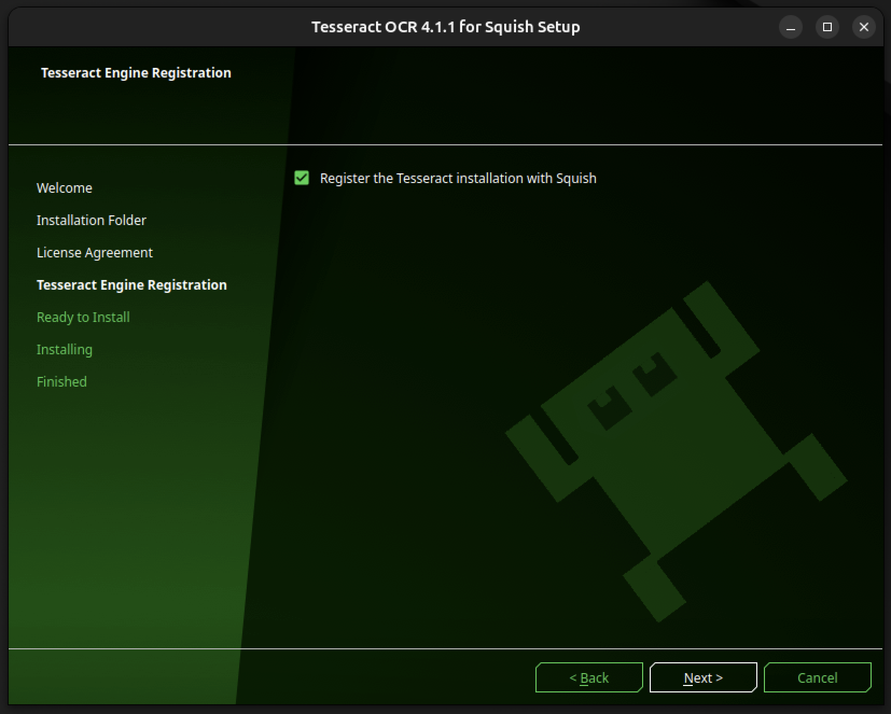

# OCR Config in Ubuntu 24.04

## Prerequisites

- Display card that allows GPU accelleration (ex. Ubuntu on Xorg, x11)
    - Check current display server: 
    ```echo $XDG_SESSION_TYPE```

- _tesseract-for-squish-4.1.1_ download (See [here](https://doc.qt.io/squish/ocr-and-installing-tesseract-for-squish.html) for  downlaod)


## Instructions

1. Follow tesseract installation process. Make sure to enable **Register the Tesseract installation with Squish**.

2. Configure Tesseract OCR engine by clicking **Edit > Preferences** to open the Preferences window. Then in the side bar, **Squish > OCR > Tesseract** to ensure installation path with Squish. 
3. Verify with test run. 


## Verify with test run


1. Record a test case the way you normally would using the Squish GUI
2. Find **OCR Text** under the **Verify** tab 
3. Select automatically detected text or configure your own **Search Text** Verification


## FAQ

1. Error: ```Squish desktop screenshot failed error``` when trying to implement OCR Verification.

    - This issue is due to incompatible display card/server. Depending on the Ubuntu version, the default display card may be **wayland**, which is incompatible with Squish OCR functions. 

2. When attempting to verify tesseract installation using **tesseract --version**, I get the following output:

    symbol lookup error: tesseract: undefined symbol: _ZN9tesseract16TessPAGERendererC1EPKc

    - This issue is caused by incompatible Leptonica and Tesseract downloads, or multiple Tesseract versions installed in the system. Clear Tesseract and all related libraries and reinstall.

3. Error: ``` Failed retrieving the engine properties: Cannot find the Leptonica library ```
    - If encountering Leptonica library issues, verify Squish path and, if applicable, change the default **lib64** folder to **lib** as listed in the tesseract download.