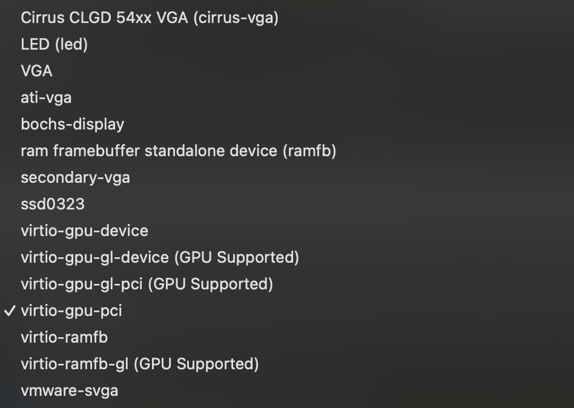
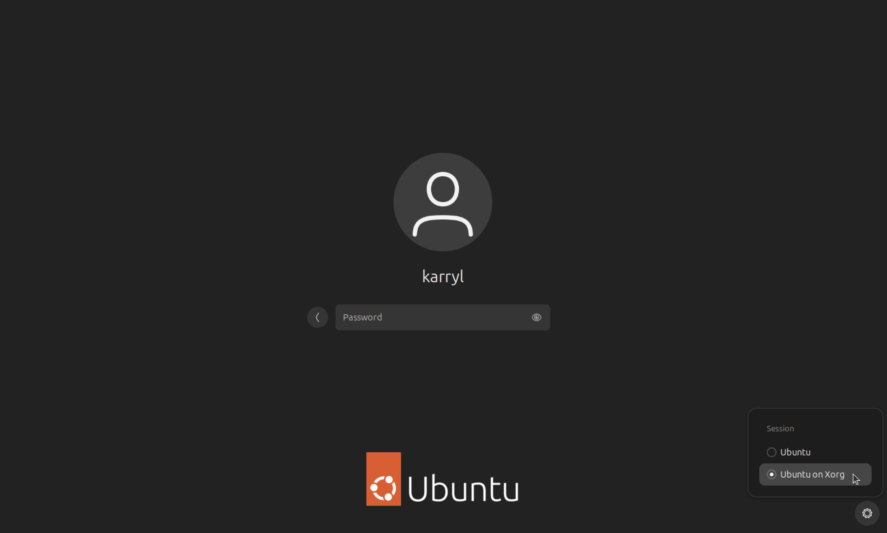

# OCR Config in Ubuntu 24.04

## Prerequisites

- Display card that allows GPU accelleration (ex. Ubuntu on Xorg, x11)
    - Check current display server: 
    ```echo $XDG_SESSION_TYPE```

- _tesseract-for-squish-4.1.1_ download (See [here](https://doc.qt.io/squish/ocr-and-installing-tesseract-for-squish.html) for  downlaod)


## Instructions

1. Follow tesseract installation process. Make sure to enable **Register the Tesseract installation with Squish**.

2. Configure Tesseract OCR engine by clicking **Edit > Preferences** to open the Preferences window. Then in the side bar, **Squish > OCR > Tesseract** to ensure installation path with Squish. 
3. Verify with test run. 


## Verify with test run


1. Record a test case the way you normally would using the Squish GUI
2. Find **OCR Text** under the **Verify** tab 
3. Select automatically detected text or configure your own **Search Text** Verification


## FAQ

1. Error: ```Squish desktop screenshot failed error``` when trying to implement OCR Verification.

    - This issue is due to incompatible display card/server. Depending on the Ubuntu version, the default display card may be **wayland**, which is incompatible with Squish OCR functions. 

    **1a. Make sure you choose a proper display card:**

     

    ** NOTE: If you see Guest drivers are required for GPU acceleration when selecting **virtio-gpu-gl-pci**, run:
    ```
    sudo apt install mesa-utils mesa-vulkan-drivers # mesa package for virtio-gpu
    sudo apt install qemu-guest-agent # to optimize performance between host and guat
    sudo apt install xserver-xorg-video-qxl
    sudo apt update
    sudo apt upgrade
    ```

    **1b. Run the following commands:**
    ```
    #  Reconfigure Xorg
    sudo dpkg-reconfigure xserver-xorg
    sudo apt install --reinstall xorg

    # Update drivers
    sudo apt update
    sudo apt upgrade
    sudo ubuntu-drivers autoinstall

    # Make sure you have the appropriate drivers
    sudo apt install xserver-xorg-video-qxl # for virtio
    sudo apt install xserver-xorg-video-vmware # for vmware

    # Check if you're using GPU acceleration
    sudo apt install qemu-guest-agent
    glxinfo | grep "OpenGL renderer"
    ```

    **1c. In the Login screen, click the Xorg on the bottom left corner**.
    
    


2. When attempting to verify tesseract installation using **tesseract --version**, I get the following output:

    symbol lookup error: tesseract: undefined symbol: _ZN9tesseract16TessPAGERendererC1EPKc

    - This issue is caused by incompatible Leptonica and Tesseract downloads, or multiple Tesseract versions installed in the system. Clear Tesseract and all related libraries and reinstall.

    2a.  Find all instances of tesseract and remove: 
    ```
    find / -type d -name "tesseract" 2>/dev/null
    sudo find /usr -name "tesseract*" -exec rm -rf {} \;
    sudo find /opt -name "tesseract*" -exec rm -rf {} \;
    ```

    2b. Force Rebuild and Reinstall Tesseract
    ```
    # Navigate to the Tesseract source directory: 
    cd /path/to/tesseract/source

    # Clean any previous builds
    make clean

    # Reconfigure and rebuild
    ./autogen.sh
    ./configure
    make
    sudo make install
    sudo ldconfig  # Update linker cache
    ```

    2c. Reinstall tesseract and libtesseract:
    ```
    sudo apt remove --purge tesseract-ocr libtesseract-dev
    sudo apt autoremove

    # Reinstall the official packages
    sudo apt install tesseract-ocr libtesseract-dev
    ```


3. Error: ``` Failed retrieving the engine properties: Cannot find the Leptonica library ```
    - If encountering Leptonica library issues, verify Squish path and, if applicable, change the default **lib64** folder to **lib** as listed in the tesseract download.